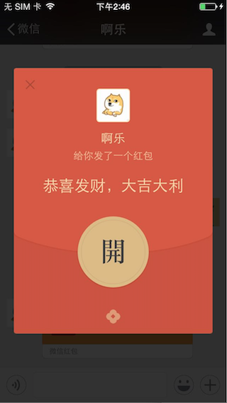
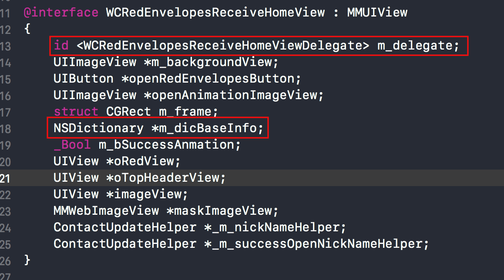
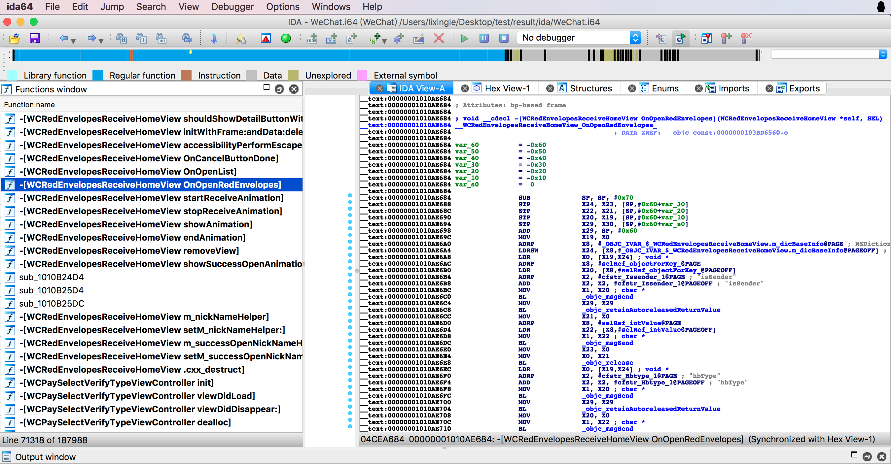
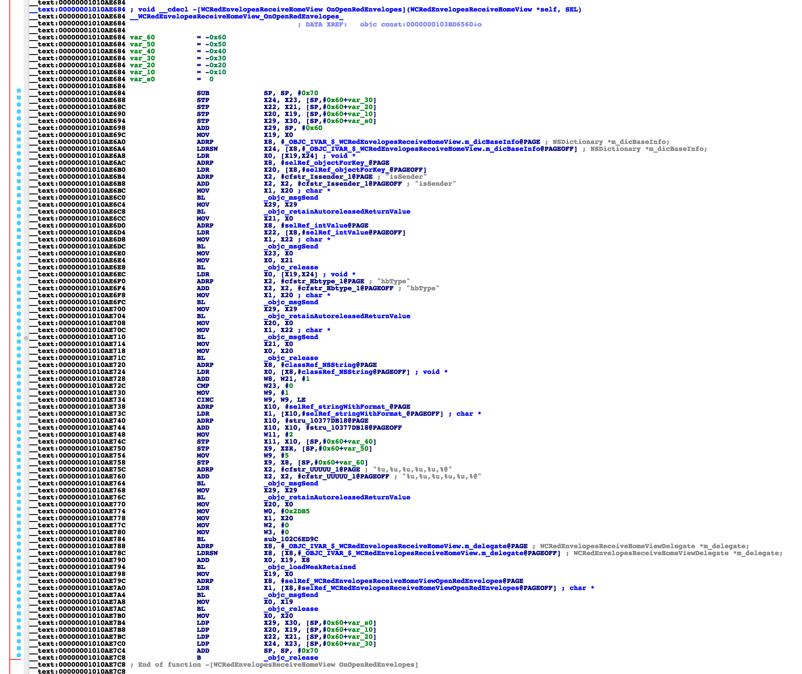

# 微信抢红包中


在上一篇文章中我们已经知道了红包消息uiMessageType是49，下面我们只要找到抢红包的方法就可以实现自动抢红包了。


要想找到抢红包的方法，思路是查看点击抢红包按钮时哪个方法调用了，然后反汇编抢红包方法看看具体都做了什么。

### 一、分析抢红包页面log

我们知道收红包分为两步，第一步点击聊点消息弹出红包页面，第二步点击红包的【开】按钮抢红包。我们下面先来分析第二步的方法调用逻辑。

#### 1. 借助Cycript或者Reveal找到抢红包界面

**1.1** 点击红包消息，弹出下面的页面




**1.2** 使用cycript附加微信进程

 具体操作看下图

**1.3** 获取当前页面名

命令行部分输出如下：


可以看出，是在`Window`上弹出的一个`View`。这个红包`View`就是`WCRedEnvelopesReceiveHomeView`。在class-dump导出的头文件中也能找到`WCRedEnvelopesReceiveHomeView`同名的头文件`WCRedEnvelopesReceiveHomeView.h`。

#### 2. 分析抢红包log

**2.1** 使用logify.pl给WCRedEnvelopesReceiveHomeView所有函数添加log

当开(抢)红包的时候，观察log输出如下：


所以猜测`OnOpenRedEnvelopes`方法和抢红包有关。下面就是逆向的终点也就是难点了，我们需要静态反汇编查看`OnOpenRedEnvelopes`方法的具体实现，看看它内部调用了哪些方法，有没有抢红包接口。

### 二、反汇编抢红包方法

以上分析的`OnOpenRedEnvelopes`函数只能在聊天页面点红包消息后才能使用。下面要分析更通用的方法，现在就不能通过lldb的调用堆栈来解决了。因为调用堆栈是谁调用了`OnOpenRedEnvelopes`函数，我们现在要分析`OnOpenRedEnvelopes`调用了谁。

####1. 分析抢红包view头文件

在反汇编之前我们先仔细研究下`WCRedEnvelopesReceiveHomeView.h`头文件。



观察头文件发现`m_delegate`和`m_dicBaseInfo`和UI无关，我们通过log看看`m_dicBaseInfo`中存了什么。修改Tweak文件如下：

```objective-c
@interface WCRedEnvelopesReceiveHomeView
{
    NSDictionary *m_dicBaseInfo;
    id m_delegate;
}
@end
%hook WCRedEnvelopesReceiveHomeView
- (void)OnOpenRedEnvelopes {
    //%orig;
    NSDictionary *dic = MSHookIvar<NSDictionary *>(self,"m_dicBaseInfo");
    NSArray *keys = [dic allKeys];
    for (NSInteger index = 0 ; index < keys.count ; index++){
    NSLog(@"%@:%@",keys[index], [dic objectForKey:keys[index]]);
    }
    id dele = MSHookIvar<id>(self , "m_delegate");
    NSLog(@"m_delegate class:%@",dele);
}
%end
```

点击拆红包查看log，输出如下：


先搁置，下面会用到，接下来反汇编分析`OnOpenRedEnvelopes`方法内部实现。

####2. 查找OnOpenRedEnvelope源码

***2.1*** 用IDA打开我们第一篇砸壳后目录中的`wechat` mach-o文件

**2.2 ** 在左侧Functions Window中搜索`OnOpenRedEnvelopes`方法名


搜索结果如下图，左侧是搜到的方法名，右侧就是OnOpenRedEnvelopes的源码了，当然这里的源码是汇编。



#### 3. 分析汇编代码

OnOpenRedEnvelopes的汇编源码如下图，我们需要把汇编代码翻译成OC代码，下面一行一行的来分析。



**2.0.1** 从`#00000001010AE6A0`地址到`#00000001010AE6CC` ，我们找到第一个_objc_msgSend，这一句我们很熟悉就是OC中函数调用。他的C函数声明`void objc_msgSend(id self, SEL cmd, ...)`，所以这个函数至少有两个参数，第一个是函数调用者，第二个是函数签名。


所以寄存器X0存着self,寄存器X1存放着cmd,如果cmd需要参数，一次存储在X2、X3...

从 `LDR  X0, [X19,X24] ; void *`这行代码中可以看到`X0 = [X19,X24] = m_dicBaseInfo`；从代码中可以看到` X1 = X20 = objectForKey:`因为函数`objectForKey:`还需要一个参数，所以`X2`中就是`key`，`X2 = "isSender"`。执行完`BL`返回值保存在X0寄存器中，然后赋值给了X21。

伪代码如下：

`NSString  *isSender =[self.m_dicBaseInfo objectForKey:@"isSender"];`

**2.0.2** 为了熟悉汇编源码，我们一起继续分析一句


依然是找到下一个`BL   _objc_msgSend`, 这时self = X0 就等于上句代码的返回值isSender，cmd = X1 = X22 = intValue ，调用完BL，返回值赋值给了X23。所以这几句汇编对应的伪代码为：

NSInteger isSenderInt = [isSender intValue];

怎么样，汇编也没有这么难吧。按照这个节奏我们分析完整个`OnOpenRedEnvelopes`。

**2.0.3** OnOpenRedEnvelopes伪代码

```objective-c
NSInteger isSender = [[self.m_dicBaseInfo objectForKey:@"isSender"] intValue];
NSInteger hbType = [[self.m_dicBaseInfo objectForKey:@"hbType"] intValue];
if (isSender == 0) {
	//此处省略几行添加log的代码，因为只有sender时候才会调用，我们一般不会抢自己发的红包。
}
[self.delegate  WCRedEnvelopesReceiveHomeViewOpenRedEnvelopes];
```

所以OnOpenRedEnvelopes中最重要也是唯一有用的一行代码就是上边的最后一行。在第一步WCRedEnvelopesReceiveHomeView.h中我们分析过delegate的类型是WCRedEnvelopesReceiveControlLogic。所以接下来我们需要分析WCRedEnvelopesReceiveControlLogic中的WCRedEnvelopesReceiveHomeViewOpenRedEnvelopes方法。

####3. 分析WCRedEnvelopesReceiveHomeViewOpenRedEnvelopes方法

查看WCRedEnvelopesReceiveControlLogic同名的头文件可以看到确实有WCRedEnvelopesReceiveHomeViewOpenRedEnvelopes函数的声明，下面我们反汇编这个方法

WCRedEnvelopesReceiveHomeViewOpenRedEnvelopes函数的汇编代码我就不在这里粘贴出来了大概有520行。与上一步分析方法相同，直接上我翻译的伪代码：

```objective-c
- (void)WCRedEnvelopesReceiveHomeViewOpenRedEnvelopes {
    id data = MSHookIvar<WCRedEnvelopesControlData *>(self, "m_data");
    NSLog(@"data class: %@", [data class]);
    CMessageWrap *msgWrap = [data  m_oSelectedMessageWrap];
    WCPayInfoItem *payInfoItem = [msgWrap m_oWCPayInfoItem];
    NSString *m_c2cNativeUrl = [payInfoItem m_c2cNativeUrl];
    NSLog(@"m_c2cNativeUrl: %@", m_c2cNativeUrl);


    NSInteger length = [@"wxpay://c2cbizmessagehandler/hongbao/receivehongbao?" length];
    NSString *subStr  = [m_c2cNativeUrl substringFromIndex: length];
    NSDictionary *dic =  [%c(WCBizUtil) dictionaryWithDecodedComponets:subStr separator:@"&"];
    NSArray *keys = [dic allKeys];
    for (NSInteger index = 0 ; index < keys.count ; index++){
        NSLog(@"%@:%@",keys[index], [dic objectForKey:keys[index]]);
    }
    NSMutableDictionary *myDictionary = [NSMutableDictionary dictionary] ;
    [myDictionary setObject:@"1" forKey:@"msgType"];
    NSString *sendId = [dic objectForKey:@"sendid"];
    [myDictionary setObject:sendId forKey:@"sendId"];
    NSString *channelId = [dic objectForKey:@"channelid"];
    [myDictionary setObject:channelId forKey:@"channelId"];
    CContactMgr *service =  [[%c(MMServiceCenter) defaultCenter] getService:[%c(CContactMgr) class]];
    CContact *contact =  [service getSelfContact];
    NSString *displayName = [contact getContactDisplayName];
    [myDictionary setObject:displayName forKey:@"nickName"];
    NSString *headerUrl =  [contact m_nsHeadImgUrl];
    [myDictionary setObject:headerUrl forKey:@"headImg"];

    if (nil != msgWrap) {
        [myDictionary setObject:m_c2cNativeUrl forKey:@"nativeUrl"];
    }
    MMMsgLogicManager *logicManager =  [[%c(MMServiceCenter) defaultCenter] getService:[%c(MMMsgLogicManager) class]];
    WeixinContentLogicController *currentLogicController = [logicManager GetCurrentLogicController];

    if (nil != currentLogicController) {
        CContact *m_contact = [currentLogicController m_contact];
        if (nil != m_contact){
            [myDictionary setObject:[m_contact m_nsUsrName] forKey:@"sessionUserName"];
            NSLog(@"进来了。。。");
        }
    }
    NSDictionary * baseInfo = [data m_structDicRedEnvelopesBaseInfo];
    NSString *timingIdentifier = [baseInfo objectForKey:@"timingIdentifier"];
    if (0 != [timingIdentifier length]){
        [myDictionary setObject:timingIdentifier forKey:@"timingIdentifier"];
    }
    WCPayLogicMgr *payLogicMgrce = [[MMServiceCenter defaultCenter] getService: [%c(WCPayLogicMgr) class]];
    
    [payLogicMgrce setRealnameReportScene:1003];
    
    id agree_duty = [baseInfo objectForKeyedSubscript:@"agree_duty"];

    WCRedEnvelopesLogicMgr *redEnvelopesLogicMgr = [[MMServiceCenter defaultCenter] getService:[WCRedEnvelopesLogicMgr class]];
    [redEnvelopesLogicMgr OpenRedEnvelopesRequest:myDictionary];

    [payLogicMgrce checkHongbaoOpenLicense:agree_duty acceptCallback:^{
        [WAJSEventHandler_access handleJSEvent:^{
    	}];
    } denyCallback:^{
        [WAJSEventHandler_access handleJSEvent:^{
    	}];
    }]
   //%orig;
}
%end
```

最后我们根据classdump出来的头文件，添加上一些声明，Tweak.xm最终变成下边这样。我们注释掉原来的`%orig`用我们自己反汇编出来的代码，经过测试，点击抢红包时虽然没有动画，但确实已经把红包抢了。

```
#import <Foundation/Foundation.h>
@interface WCPayInfoItem
@property(retain, nonatomic) NSString *m_c2cNativeUrl;
@end
@interface CMessageWrap
@property(retain, nonatomic) WCPayInfoItem *m_oWCPayInfoItem;
@end
@interface WCRedEnvelopesControlData
@property(retain, nonatomic) CMessageWrap *m_oSelectedMessageWrap;
@property(retain, nonatomic) NSDictionary *m_structDicRedEnvelopesBaseInfo;
@end

@interface WCBizUtil
+ (id)dictionaryWithDecodedComponets:(id)arg1 separator:(id)arg2;
@end
@interface MMServiceCenter
+ (id)defaultCenter;
- (id)getService:(Class)arg1;
@end
@interface CContact
@property(retain, nonatomic) NSString *m_nsHeadImgUrl;
@property(retain, nonatomic) NSString *m_nsUsrName;
- (id)getContactDisplayName;
@end

@interface CContactMgr
- (id)getSelfContact;
@end
@interface MMMsgLogicManager
- (id)GetCurrentLogicController;
@end
@interface WCRedEnvelopesLogicMgr
- (void)OpenRedEnvelopesRequest:(id)arg1;
@end
@interface WCPayLogicMgr
- (void)setRealnameReportScene:(unsigned int)arg1;
//- (void)checkHongbaoOpenLicense:(id)arg1 acceptCallback:(CDUnknownBlockType)arg2 denyCallback:(CDUnknownBlockType)arg3;
@end
@interface WeixinContentLogicController
@property(retain, nonatomic) CContact *m_contact;
@end

%hook WCRedEnvelopesReceiveControlLogic
- (void)WCRedEnvelopesReceiveHomeViewOpenRedEnvelopes {
    id data = MSHookIvar<WCRedEnvelopesControlData *>(self, "m_data");
    NSLog(@"data class: %@", [data class]);
    CMessageWrap *msgWrap = [data  m_oSelectedMessageWrap];
    WCPayInfoItem *payInfoItem = [msgWrap m_oWCPayInfoItem];
    NSString *m_c2cNativeUrl = [payInfoItem m_c2cNativeUrl];
    NSLog(@"m_c2cNativeUrl: %@", m_c2cNativeUrl);
    NSInteger length = [@"wxpay://c2cbizmessagehandler/hongbao/receivehongbao?" length];
    NSString *subStr  = [m_c2cNativeUrl substringFromIndex: length];
    NSDictionary *dic =  [%c(WCBizUtil) dictionaryWithDecodedComponets:subStr separator:@"&"];
    NSArray *keys = [dic allKeys];
    for (NSInteger index = 0 ; index < keys.count ; index++){
        NSLog(@"%@:%@",keys[index], [dic objectForKey:keys[index]]);
    }
    NSMutableDictionary *myDictionary = [NSMutableDictionary dictionary] ;
    [myDictionary setObject:@"1" forKey:@"msgType"];
    NSString *sendId = [dic objectForKey:@"sendid"];
    [myDictionary setObject:sendId forKey:@"sendId"];
    NSString *channelId = [dic objectForKey:@"channelid"];
    [myDictionary setObject:channelId forKey:@"channelId"];
    CContactMgr *service =  [[%c(MMServiceCenter) defaultCenter] getService:[%c(CContactMgr) class]];
    CContact *contact =  [service getSelfContact];
    NSString *displayName = [contact getContactDisplayName];
    [myDictionary setObject:displayName forKey:@"nickName"];
    NSString *headerUrl =  [contact m_nsHeadImgUrl];
    [myDictionary setObject:headerUrl forKey:@"headImg"];

    if (nil != msgWrap) {
        [myDictionary setObject:m_c2cNativeUrl forKey:@"nativeUrl"];
    }
    MMMsgLogicManager *logicManager =  [[%c(MMServiceCenter) defaultCenter] getService:[%c(MMMsgLogicManager) class]];
    WeixinContentLogicController *currentLogicController = [logicManager GetCurrentLogicController];

    if (nil != currentLogicController) {
        CContact *m_contact = [currentLogicController m_contact];
        if (nil != m_contact){
            [myDictionary setObject:[m_contact m_nsUsrName] forKey:@"sessionUserName"];
            NSLog(@"进来了。。。");
        }
    }
    NSDictionary * baseInfo = [data m_structDicRedEnvelopesBaseInfo];
    NSString *timingIdentifier = [baseInfo objectForKey:@"timingIdentifier"];
    if (0 != [timingIdentifier length]){
        [myDictionary setObject:timingIdentifier forKey:@"timingIdentifier"];
    }
    WCPayLogicMgr *payLogicMgrce = [[%c(MMServiceCenter) defaultCenter] getService: [%c(WCPayLogicMgr) class]];
    [payLogicMgrce setRealnameReportScene:1003];
    //id agree_duty = [baseInfo objectForKeyedSubscript:@"agree_duty"];

    WCRedEnvelopesLogicMgr *redEnvelopesLogicMgr = [[%c(MMServiceCenter) defaultCenter] getService:[%c(WCRedEnvelopesLogicMgr) class]];
    [redEnvelopesLogicMgr OpenRedEnvelopesRequest:myDictionary];
/*
    [payLogicMgrce checkHongbaoOpenLicense:agree_duty acceptCallback:^{
        [WAJSEventHandler_access handleJSEvent:^{
        }];
    } denyCallback:^{
        [WAJSEventHandler_access handleJSEvent:^{
        }];
    }]
*/
    //%orig;
}
%end
```

### 三、进一步完善

上边我们已经解决了抢红包最关键的一步反汇编抢红包代码。下面我们要做的是怎么把抢红包代码移植到收红包消息方法`-(void)AsyncOnAddMsg:(NSString *)wxid MsgWrap:(CMessageWrap *)wrap`中，这样当消息一到来就能实现自动抢红包了。

可以发现`-AsyncOnAddMsg:MsgWrap:`函数中的第二个参数和抢红包方法中的`CMessageWrap *msgWrap`,参数除`timingIdentifier`外我们经过log对比也能找到，移植过来后代码如下：

```
%hook CMessageMgr
- (void)AsyncOnAddMsg:(NSString *)wxid MsgWrap:(CMessageWrap *)wrap {
    NSInteger uiMessageType = [wrap m_uiMessageType];
    NSString *nsFromUsr = [wrap m_nsFromUsr];
     if ( 49 == uiMessageType ){ //红包消息
        NSLog(@"收到红包消息");
        WCPayInfoItem *payInfoItem = [wrap m_oWCPayInfoItem];
        if (payInfoItem == nil) {
            NSLog(@"payInfoItem is nil");
        }
        NSString *m_c2cNativeUrl = [payInfoItem m_c2cNativeUrl];
        if (m_c2cNativeUrl == nil) {
            NSLog(@"m_c2cNativeUrl is nil");
        }
        NSInteger length = [@"wxpay://c2cbizmessagehandler/hongbao/receivehongbao?" length];
        NSString *subStr  = [m_c2cNativeUrl substringFromIndex: length];
        NSDictionary *dic =  [%c(WCBizUtil) dictionaryWithDecodedComponets:subStr separator:@"&"];
        NSMutableDictionary *myDictionary = [NSMutableDictionary dictionary] ;
        [myDictionary setObject:@"1" forKey:@"msgType"];
        NSString *sendId = [dic objectForKey:@"sendid"];
        [myDictionary setObject:sendId forKey:@"sendId"];
        NSString *channelId = [dic objectForKey:@"channelid"];
        [myDictionary setObject:channelId forKey:@"channelId"];
        CContactMgr *service =  [[%c(MMServiceCenter) defaultCenter] getService:[%c(CContactMgr) class]];
        if (service == nil) {
            NSLog(@"service is nil");
        }
        CContact *contact =  [service getSelfContact];
        NSString *displayName = [contact getContactDisplayName];
        [myDictionary setObject:displayName forKey:@"nickName"];
        NSString *headerUrl =  [contact m_nsHeadImgUrl];
        [myDictionary setObject:headerUrl forKey:@"headImg"];
        if (nil != wrap) {
            [myDictionary setObject:m_c2cNativeUrl forKey:@"nativeUrl"];
        }
        [myDictionary setObject:[wrap m_nsFromUsr] forKey:@"sessionUserName"];
    }
    //%orig;
}
%end
```

字典中我们少了一个键值对`timingIdentifier`,怀疑这个是一个后台传过来的时间戳，如果不传递可能有封号的风险。先不着急，我们继续分析。

####1.0 分析 WCRedEnvelopesLogicMgr类

**1.1** 通过logify查看日志（方法我们讲过不在赘述），每次打开红包、抢红包都会调用以下3个方法


Log输出如下


- 在群里和个人聊天分别尝试发现

  inWay:1 //单聊

  inWay:0 //群聊

  ​

- 经过分析以上3个函数调用顺序和`OnWCToHongbaoCommonResponse`函数的两个参数，在hongBaoRes.retText.buffer中发现我们至今未解决的`timingIdentifier`出现了。经过验证这个就是抢红包时传的timingIdentifier一致。

- 分析hongBaoRes其他参数意思

  **可抢状态：**

  cgiCmdid = 3  自己可抢  ，cgiCmdid = 4 自己抢完， cgiCmdid = 自己已抢过

   hbStatus = 2  可抢红包， hbStatus = 2  自己抢完， hbStatus = 4  不可抢 ，"hbStatus":5 过期红包

  **是否自己发的：**

  "isSender":0 别人发的，"isSender":1 自己发的

  **是否群红包：**

  "hbType":1 群红包，"hbType":0 个人红包

  **自己是否抢过**

  "receiveStatus":0 未抢过 ， "receiveStatus":2 已抢过


### 四、最终自动抢红包逻辑

最终的抢红包逻辑就是

- 在`AsyncOnAddMsg:MsgWrap:`函数中收到`uiMessageType=49`的红包消息时，调用`WCRedEnvelopesLogicMgr`的`ReceiverQueryRedEnvelopesRequest:`方法。
- 然后在`WCRedEnvelopesLogicMgr`的回调函数中`OnWCToHongbaoCommonResponse: Request:`拿到`timingIdentifier`
- 然后再调用`WCRedEnvelopesLogicMgr`的抢红包函数`OpenRedEnvelopesRequest`。


下一篇文章快速通道：[iOS逆向（微信抢红包下）](https://github.com/Lves/WXRedTweak/blob/master/Articles/%E5%BE%AE%E4%BF%A1%E6%8A%A2%E7%BA%A2%E5%8C%85%E4%B8%8B.md)


